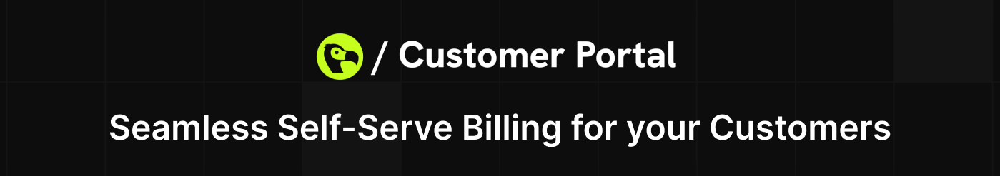

# Dodo Payments Customer Portal

<p align="center">
  

  <div align="center">
    <a href="https://docs.dodopayments.com/features/customer-portal">
      
    </a>
    <a href="https://discord.gg/bYqAp4ayYh">
      
    </a>
  </div>
</p>

Modern, type-safe customer billing portal built with Next.js 15, React 19, TypeScript, Tailwind CSS, and shadcn/ui. This portal lets your customers manage subscriptions, view invoices, download license keys, and update billing details.

Documentation: [`Customer Portal – Dodo Payments Docs`](https://docs.dodopayments.com/features/customer-portal)

## Features

- Subscription overview and actions (upgrade, cancel)
- Billing history and invoice download
- License keys management and digital delivery
- Profile update and business details
- Internationalization (via `next-intl`)
- Accessible UI using shadcn/ui and Radix primitives

## Tech Stack

- Next.js App Router (RSC-first)
- React 19 + TypeScript
- Tailwind CSS + shadcn/ui + Radix UI
- Redux Toolkit for client state where needed

## Getting Started

1. Install dependencies

```bash
npm install
```

2. Run the dev server

```bash
npm run dev
```

3. Open http://localhost:3000

## Project Structure

Key directories:

- `src/app` – routes, layouts, and pages
- `src/components` – UI components (shadcn/ui + custom)
- `src/lib` – helpers for HTTP, i18n, currency, dates

## Internationalization

This app uses `next-intl`.

- Messages live in `messages/`
- Request-time config in `src/i18n/`

## Contributing

We welcome contributions! See [`CONTRIBUTING.md`](CONTRIBUTING.md) for guidelines.

## Security

Please report vulnerabilities responsibly. See [`SECURITY.md`](SECURITY.md).

## License

Distributed under the GPL-3.0 license. See [`LICENSE`](LICENSE).
